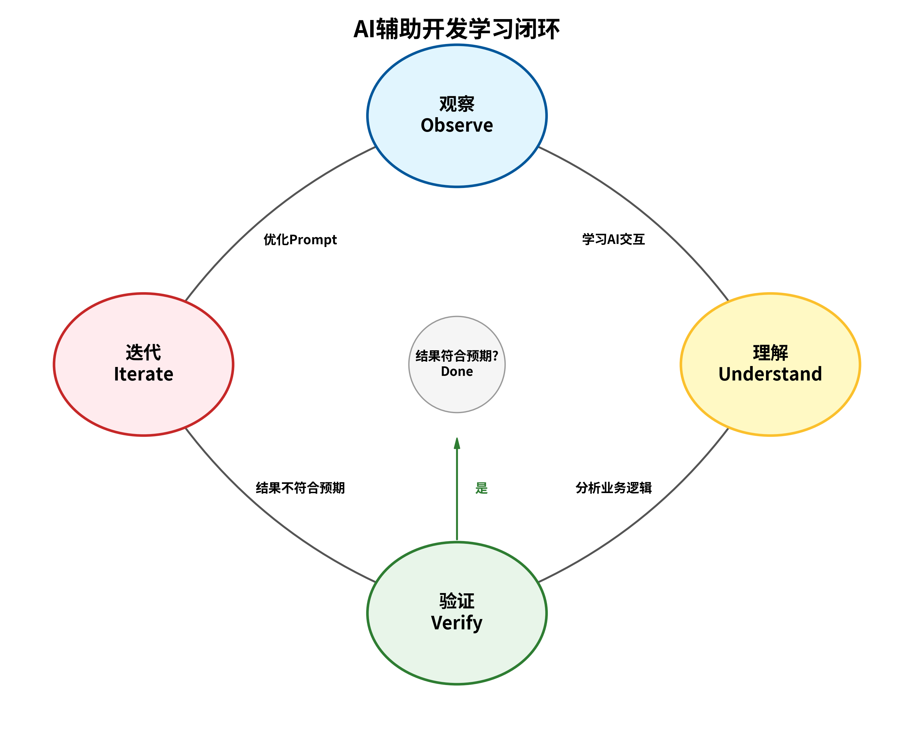

# AI辅助产品开发实战课程 - Lesson 0 逐字稿

---

## 开场

**讲师**：

“大家好，欢迎来到《AI辅助产品开发实战》这门课程。我是大家的讲师。

这门课程是为所有有产品想法，但完全没有代码基础的同学设计的——无论你是产品经理、设计师，还是运营人员。我们的目标非常明确：让你亲手从零开始，构建一个完整功能的微信小程序。

但我们不学复杂的编程语法，而是学习如何与AI编程助手高效协作，让AI成为你实现产品创意的强大工具。在整个课程中，我们将主要使用一个名为 Claude Code 的AI工具，并辅以 Cursor 编辑器来完成我们的项目。

本次课程的案例项目，是一个叫做 ‘TeamVenture AI团建策划助手’ 的小程序。我们将一起，一步步把它变为现实。”

---

## 单元0.1：案例项目介绍 - TeamVenture（5分钟）

**讲师**：

“在开始一切技术准备之前，我们先来看看，通过这门课程，我们最终要做出一个什么样的产品。

这就是我们的实战项目——**TeamVenture**。

它的产品定位是：一款AI团建策划助手，旨在帮助公司的HR或行政人员，快速、智能地生成高质量的团建活动方案。

它的核心功能非常清晰：

1.  **需求收集**：用户输入团建的人数、预算、城市、以及风格偏好等。
2.  **方案生成**：AI根据需求，智能生成3套风格各异的团建方案，比如“刺激冒险型”、“休闲放松型”和“文化探索型”。
3.  **方案管理**：用户可以保存、对比、修改这些方案。
4.  **供应商对接**：对于最终确定的方案，可以一键联系合作的供应商（这部分在后续课程实现）。

所以，它的核心用户旅程就是：`输入需求 → AI生成方案 → 查看对比 → 确认方案`。

在本课程中，我们将重点完成前端小程序的核心功能开发。至于后端的服务和部署，我们会在后续的进阶课程中覆盖。

**本单元的验证点**：请大家花一点时间，完整地理解TeamVenture的产品定位和核心功能。想一想，如果你是用户，你期望它是什么样的？”

---

## 单元0.2：课程介绍与学习方法（5分钟）

*48	“了解了我们要做的产品，接下来我们来谈谈这门课独特的学习方法。它和传统的编程课非常不同，我们遵循一个四步循环：**观察、理解、验证和迭代**。
49	
50	```mermaid
51	graph TD
52	 x
63	```
64	
65	1.  **观察**：你需要仔细看我是如何向AI描述产品需求，以及AI是如何根据这些需求生成代码的。2.  **理解**：你的重点不是记住代码长什么样，而是去理解每一段代码背后所实现的业务逻辑是什么。比如，这段代码是为了实现‘用户登录’，那段代码是为了‘显示活动列表’。
3.  **验证**：我们会把AI生成的代码，立刻在真实的环境中运行起来，检查功能是否和我们预想的一致。
4.  **迭代**：如果结果不完美，这很正常。你需要学习如何调整和优化你对需求的描述，引导AI给出更精准的答案。这就像与一位聪明的同事沟通，你需要清晰地表达你的想法。

那么，学习这门课，你‘**不需要**’做什么呢？

*   你**不需要**死记硬背任何编程语法。
*   你**不需要**理解复杂的技术底层原理。
*   你**不需要**有任何编程经验，零基础就是最好的起点。

你需要做的，恰恰是你最擅长的事情：

*   **清晰地描述产品需求**。
*   **验证功能是否符合预期**。
*   以及，**学会如何与AI高效沟通**。

好，作为本单元的第一个验证点，请大家思考一下：‘AI辅助开发’和‘传统编程学习’，这两者最核心的区别是什么？你可以在我们的课程交流群里分享你的看法。”

---

## 单元0.3：VPN与网络环境配置（10分钟）

**讲师**：

“接下来，我们进入第一个也是最关键的动手环节：配置网络环境。

很多同学在这一步会遇到困难，但请放心，我们把这个过程拆解得非常细致。首先，我们要明确一个概念：现在的网络服务通常由两部分组成——**‘机场服务商’**（提供线路订阅）和**‘客户端软件’**（负责连接）。

你需要先购买一个‘机场服务’，获取一个**订阅链接**（通常以 `http` 开头），然后把它填入你的客户端软件中。

下面我们分平台手把手教学：

### 1. Windows 平台

*   **推荐软件**：v2rayN 或 Clash Verge。
*   **操作步骤**：
    1.  下载并解压软件（注意：不要放在含中文的路径下）。
    2.  打开软件，找到‘订阅’或‘Profiles’菜单。
    3.  点击‘添加订阅’，把你在机场购买的订阅链接粘贴进去，点击更新。
    4.  在节点列表中，右键选择一个节点（推荐香港或新加坡节点），设为‘活动节点’。
    5.  **关键一步**：在系统托盘（右下角）找到软件图标，右键选择‘系统代理’ -> ‘自动配置系统代理’。图标变色即代表开启成功。

### 2. Mac 平台

*   **推荐软件**：ClashX Pro 或 Clash Verge。
*   **操作步骤**：
    1.  下载 `.dmg` 安装包并安装。
    2.  首次打开需要输入开机密码授权。
    3.  点击状态栏的小猫图标，选择‘配置’ -> ‘托管配置’ -> ‘管理’。
    4.  点击‘添加’，粘贴订阅链接。
    5.  **关键一步**：点击状态栏图标，勾选‘设置为系统代理’。同时，建议在‘出站模式’中选择‘规则判断’，这样访问国内网站不会变慢。

### 3. iOS (iPhone/iPad) 平台

*   **难点**：中国区 App Store 无法下载相关软件。
*   **解决方案**：你需要一个**非中国区（如美区）的 Apple ID**。
    *   *方法A*：淘宝购买（有风险，仅限下载用）。
    *   *方法B*：自己注册（推荐，需准备一个未注册过 Apple ID 的邮箱）。
*   **推荐软件**：Shadowrocket（俗称‘小火箭’，需付费，约 $2.99）。
*   **操作步骤**：
    1.  打开 App Store，点击右上角头像，滑到底部‘退出登录’。
    2.  登录美区 Apple ID。
    3.  搜索并下载 Shadowrocket。
    4.  打开小火箭，点击右上角 `+` 号，类型选择 `Subscribe`（订阅）。
    5.  粘贴订阅链接，点击保存。
    6.  回到首页，开启顶部的开关，首次连接会弹出 VPN 权限确认，点击‘Allow’并输入锁屏密码。

### 4. Android 平台

*   **推荐软件**：Clash for Android 或 v2rayNG。
*   **操作步骤**：
    1.  下载 `.apk` 安装包（通常机场官网会提供下载链接）。
    2.  打开软件，点击‘配置’ -> ‘新配置’ -> ‘从 URL 导入’。
    3.  粘贴订阅链接，点击右上角保存。
    4.  回到主界面，点击灰色的启动按钮。
    5.  系统会弹出‘网络连接请求’，点击‘确定’。

**最后，一个通用的验证方法**：
无论你用哪个平台，配置完成后，请打开浏览器访问 `https://claude.ai`。如果能秒开，恭喜你，你的网络环境已经准备就绪！如果打不开，请检查是否开启了‘系统代理’或‘全局路由’模式。”

---

## 单元0.4：Git版本控制基础（15分钟）

**讲师**：

“我们继续下一个工具的准备：Git。

很多同学一听到‘版本控制’、‘命令行’就头大。但其实，Git 解决的是一个我们每个人都遇到过的痛点。

### 1. 痛点场景：告别‘文件重命名大法’

大家写文档的时候，是不是经常干这种事？
*   `方案_初稿.doc`
*   `方案_修改版.doc`
*   `方案_最终版.doc`
*   `方案_打死不改版.doc`
*   `方案_绝对不改版_final_v2.doc`

这种方式不仅乱，而且你很难知道 `v2` 和 `v1` 到底改了哪几个字。

**Git 就是为了解决这个问题而生的。** 它可以帮你记录每一次修改的‘快照’，而且不需要你复制一堆文件。

### 2. 核心概念的‘可视化’类比

为了让大家彻底理解 Git，我们用一个**‘网购’**的例子来类比：

| Git 概念 | 类比 | 解释 |
| :--- | :--- | :--- |
| **工作区 (Working Directory)** | **货架** | 你正在编辑的文件，就像货架上的商品，你可以随意拿取、修改。 |
| **暂存区 (Staging Area)** | **购物车** | 你觉得改好了，准备提交的文件。就像把商品放进购物车，确认无误后再去结账。 |
| **提交 (Commit)** | **结账/订单** | 生成一个永久的记录。就像结账后生成的订单，不可更改，随时可查。 |
| **仓库 (Repository)** | **仓库** | 存放所有历史订单的地方。 |
| **分支 (Branch)** | **平行宇宙** | 想象一下，你可以开启一个‘平行宇宙’去尝试一个大胆的想法（比如把背景改成粉色）。如果改坏了，直接关掉这个宇宙，主宇宙毫发无损；如果改好了，就把两个宇宙合并。 |

### 3. GitHub 是什么？

如果说 Git 是你电脑上的‘时光机’，那 GitHub 就是云端的‘保险箱’和‘社交网络’。

*   **云端备份**：你的电脑坏了，代码还在 GitHub 上，随时可以下载下来继续写。
*   **团队协作**：你和同事可以同时修改同一个项目，GitHub 会帮你们合并代码。

### 4. Claude Code 的‘自动驾驶’

在传统的编程课里，你需要背诵 `git add .`、`git commit -m "xxx"`、`git push` 等等命令。

但在我们的课程里，**你几乎不需要手动敲这些命令**。

Claude Code 就像一个经验丰富的副驾驶。当你告诉它：“帮我把这个功能提交一下”，它会自动帮你：
1.  把修改的文件放入‘购物车’（`git add`）。
2.  生成一个清晰的‘订单备注’（`git commit`）。
3.  把代码同步到云端（`git push`）。

所以，你只需要理解 Git 在做什么，而不需要担心记不住命令。

**本单元的验证点**：
1.  打开终端，输入 `git --version`，确认安装成功。
2.  注册一个 GitHub 账号（如果还没有的话），并记住你的用户名和密码。”

---

## 单元0.5：Claude Code工具介绍与GitHub关## 单元0.5：Claude Code 深度解析与配置（10分钟）

**讲师**：

“接下来，我们要介绍一位重量级的‘AI 程序员’——**Claude Code**。

很多同学可能用过网页版的 Claude，觉得它聊天很聪明。但 **Claude Code** 完全不同，它是 Anthropic 官方专门为开发者打造的**命令行工具**。

### 1. 为什么我们需要 Claude Code？

网页版 AI 和 Claude Code 的最大区别在于**‘执行力’**：

*   **网页版 Claude**：像是一个坐在玻璃房里的顾问。你可以问它代码怎么写，它会写在屏幕上给你看。但它**摸不到**你的文件，也不能帮你运行代码。你需要自己复制、粘贴、保存、运行。
*   **Claude Code**：像是一个坐在你旁边的结对编程伙伴。它**直接运行在你的终端里**，拥有和你一样的权限。
    *   它可以**直接读取**你项目里的几百个文件，理解整个架构。
    *   它可以**直接修改**文件，帮你修复 Bug。
    *   它可以**直接运行**测试命令，告诉你修好了没有。

简单来说，网页版是‘动口不动手’，而 Claude Code 是**‘既动口又动手’**。

### 2. 核心能力演示

Claude Code 的强大之处在于它深度集成了开发工作流：

*   **全项目感知**：它不是只看一个文件，而是能理解整个项目的上下文。当你问“为什么这个函数报错？”时，它会自动去查找定义这个函数的其他文件。
*   **终端操作**：它可以执行 `ls` 查看目录，执行 `git diff` 查看修改，甚至执行 `npm test` 跑测试。
*   **智能规划**：面对复杂任务（比如“重构登录模块”），它会先列出计划（Plan），然后一步步执行，每一步都会检查结果。

### 3. 安装与配置实战

安装 Claude Code 需要 Node.js 环境。请大家打开终端（Terminal），跟随我操作：

1.  **安装命令**：
    输入 `npm install -g @anthropic-ai/claude-code` 并回车。
    *   `npm` 是 Node.js 的包管理器。
    *   `-g` 表示全局安装，这样你在任何目录下都能使用它。

2.  **初始化与授权**：
    安装完成后，在终端输入 `claude` 并回车。
    *   **首次登录**：它会提示你按回车键打开浏览器进行登录。请使用你的 Anthropic 账号登录。
    *   **关联 GitHub**：这是最关键的一步！登录后，终端会询问是否授权 GitHub 访问。
        *   它会提供一个授权链接。
        *   点击链接，在 GitHub 页面点击绿色的 **'Authorize Anthropic'** 按钮。
        *   **注意**：如果你的 GitHub 开启了双重验证（2FA），请准备好手机接收验证码。

3.  **验证成功**：
    当终端显示 `Login successful` 并且出现 `Claude Code >` 的提示符时，说明你已经成功拥有了这个强大的 AI 编程助手！

---

## 单元0.6：Manus——你的全自动数字员工（10分钟）

**讲师**：

“如果说 Claude Code 是你的‘编程搭子’，那么 **Manus** 就是你的**‘全能数字员工’**。

### 1. Manus 是什么？

Manus 不仅仅是一个聊天机器人，它是一个**通用型 AI Agent（智能体）**。它运行在一个安全的云端沙箱环境中，拥有自己的浏览器、终端和文件系统。

它的核心理念是 **‘思考-规划-执行’** 的闭环：
*   **Think（思考）**：理解你的模糊需求（比如“帮我查一下去大理的机票”）。
*   **Plan（规划）**：拆解任务（1. 打开携程；2. 搜索航班；3. 对比价格；4. 整理表格）。
*   **Act（执行）**：像真人一样操作浏览器，点击按钮，输入文字，甚至处理验证码。

### 2. Manus 能做什么？

在我们的课程和未来的工作中，Manus 可以扮演多种角色：

*   **产品经理助理**：
    *   *指令*：“帮我调研一下市面上排名前 5 的旅游攻略 App，分析它们的优缺点，并生成一份 PDF 报告。”
    *   *Manus*：会自动搜索、阅读应用商店评论、浏览官网，最后写出报告。
*   **数据分析师**：
    *   *指令*：“帮我找一下过去 5 年中国新能源汽车的销量数据，并画一个折线图。”
    *   *Manus*：会自动查找统计局或行业报告，提取数据，用 Python 画图。
*   **全栈工程师**：
    *   *指令*：“帮我部署刚才写的那个网页到服务器上。”
    *   *Manus*：会自动登录服务器，配置环境，上传代码，启动服务。

### 3. 关键配置：赋予 Manus 权限

为了让 Manus 更好地协助我们开发，我们需要给它一把‘钥匙’——关联 GitHub。

1.  **进入设置**：
    打开 Manus 客户端或网页版，点击左下角的 **'Settings'**（设置）图标。

2.  **集成管理**：
    在菜单中找到 **'Integrations'**（集成）或 **'Connected Apps'**。

3.  **连接 GitHub**：
    *   找到 GitHub 图标，点击 **'Connect'**。
    *   在弹出的授权窗口中，点击 **'Authorize Manus'**。
    *   **权限选择**：建议选择 **'All repositories'**（所有仓库），这样 Manus 既能帮你修改旧代码，也能帮你创建新项目。

4.  **验证状态**：
    连接成功后，你会看到 GitHub 图标旁边显示 **'Connected'** 以及你的用户名。

**总结**：
现在，左手 Claude Code（专注代码实现），右手 Manus（专注复杂任务与调研），再加上 GitHub（代码仓库），你已经组建了一支属于你自己的‘超级个体’团队！”
---

## 单元0.7：微信小程序开发环境搭建与AI实战（20分钟）

**讲师**：

“最后，我们来到了最激动人心的环节。我们将亲手搭建微信小程序的开发环境，并立即使用 AI 创造出三个真实可用的小程序案例！

### 第一部分：注册小程序账号（手把手）

首先，我们需要一个‘身份证’，也就是小程序的 AppID。

1.  **访问官网**：打开浏览器，访问 `mp.weixin.qq.com`。
2.  **点击注册**：点击右上角的‘立即注册’，选择账号类型为**‘小程序’**。
3.  **填写信息**：
    *   输入一个未注册过微信公众平台的邮箱。
    *   设置密码。
    *   输入验证码。
4.  **邮箱激活**：登录你的邮箱，点击激活链接。
5.  **主体信息登记**：
    *   如果你是个人开发者，选择**‘个人’**主体。
    *   输入你的真实姓名和身份证号。
    *   用个人微信扫描二维码进行身份验证。
6.  **获取 AppID**：
    *   注册成功后，登录后台。
    *   在左侧菜单找到 **‘开发’ -> ‘开发管理’**。
    *   点击顶部的 **‘开发设置’** 选项卡。
    *   找到 **‘AppID(小程序ID)’**，点击复制。**请把这个 ID 保存好，马上就要用到！**

### 第二部分：安装开发者工具

1.  **下载**：在微信官方文档页面，下载 **‘微信开发者工具’**（推荐下载‘稳定版’）。
2.  **安装**：按照默认设置安装即可。
3.  **登录**：打开工具，使用你的个人微信扫码登录。

### 第三部分：AI 编程初体验（高能时刻！）

现在，环境准备好了，让我们看看 AI 到底有多强。我们将用 Claude Code，在几分钟内生成三个不同类型的小程序。

请打开你的终端，进入你想要存放代码的目录，输入 `claude` 启动助手。

#### 案例 1：极速生成——简易计算器

**讲师**：
“我们先来个热身。请在 Claude 中输入以下指令：”

> **指令**：
> “请帮我创建一个微信小程序项目，名字叫 `mini-calculator`。
> 功能要求：实现一个标准的计算器，支持加减乘除运算，界面要简洁美观，仿照 iOS 的计算器风格。”

**讲师**：
“看着屏幕，Claude 会自动帮你创建文件、写 `wxml` 结构、写 `wxss` 样式、写 `js` 逻辑。
完成后，打开微信开发者工具，点击‘导入项目’，选择刚才生成的 `mini-calculator` 文件夹，填入你的 AppID。
看！一个可以使用的计算器诞生了！试着算一下 `1+1`。”

#### 案例 2：互动游戏——贪吃蛇

**讲师**：
“觉得计算器太简单？我们来做一个游戏。输入指令：”

> **指令**：
> “请帮我创建一个微信小程序项目，名字叫 `mini-snake-game`。
> 功能要求：实现一个经典的贪吃蛇游戏。
> 1. 蛇可以通过点击屏幕上下左右区域来控制方向。
> 2. 吃到食物变长并计分。
> 3. 撞墙或撞到自己游戏结束。
> 4. 界面配色要活泼一些。”

**讲师**：
“导入开发者工具运行。你现在拥有了一个自己开发的手机游戏！虽然简单，但核心逻辑一应俱全。”

#### 案例 3：业务雏形——AI行程规划 Demo

**讲师**：
“最后，我们来做一个和我们最终项目 `TeamVenture` 相关的 Demo。输入指令：”

> **指令**：
> “请帮我创建一个微信小程序项目，名字叫 `mini-travel-plan`。
> 功能要求：
> 1. 首页有一个表单，让用户输入：目的地、天数、预算。
> 2. 点击‘生成规划’按钮后，跳转到结果页。
> 3. 结果页展示一个模拟的行程列表（数据可以是写死的假数据），包含每天的上午、下午、晚上的活动安排。
> 4. 界面要高端大气，使用卡片式布局。”

**讲师**：
“运行看看。虽然数据是假的，但你已经完成了一个产品的‘原型’开发。在后续的课程中，我们将把这个‘假数据’替换成 AI 真正生成的‘真智慧’。

**本单元的验证点**：成功运行这三个案例中的任意一个，并截图发到群里炫耀一下！”

---

## Lesson 0 课后作业

**讲师**：

“恭喜大家完成了第0课的学习！在进入实战编码之前，请大家务必完成以下课后作业：

第一，**环境检查清单**。请确保你的电脑满足以下所有条件：

*   [ ] VPN配置完成，能顺畅访问 `claude.ai`。
*   [ ] Git已安装，`git --version` 命令可以正常工作。
*   [ ] Claude Code已安装，`claude --version` 命令可以正常工作。
*   [ ] **Claude Code 已成功关联 GitHub 账号**。
*   [ ] **Manus 已成功关联 GitHub 账号**。
*   [ ] 微信开发者工具已安装，并可以正常打开。
*   [ ] **已注册小程序账号并获取 AppID**。

这个清单至关重要，它将决定我们后续的课程能否顺利进行。

第二，**两个思考题**：

1.  作为一名产品人员，你认为AI辅助开发，给你带来的最大价值可能是什么？
2.  对于我们的案例项目TeamVenture，你觉得还可以增加哪些功能，来进一步提升用户体验？

请大家带着这些问题的答案，我们下一课，将正式开始编码，实现第一个核心功能！我们下节课见！”
