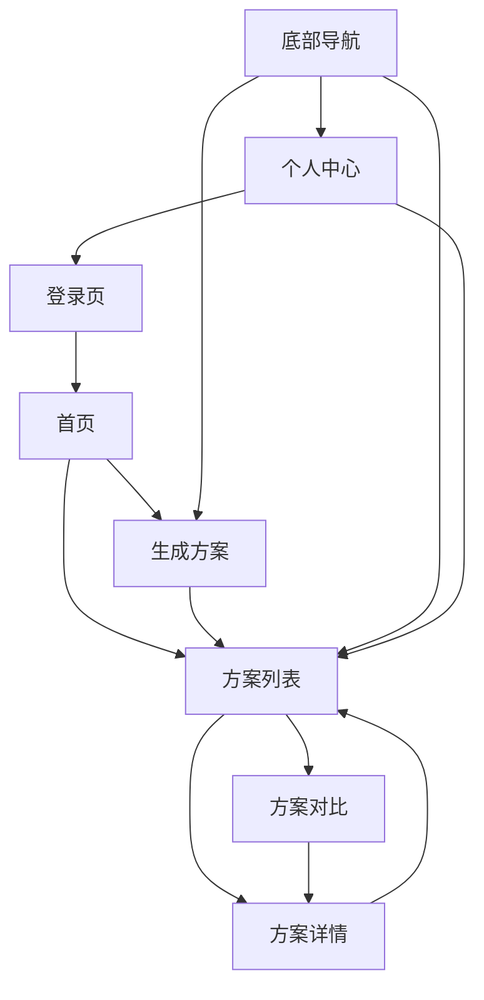

# TeamVenture 小程序页面设计文档（Obsidian 格式）

**版本**: v1.3
**更新日期**: 2026-01-06
**变更记录**:
- v1.3: 新增删除/归档功能、出发地显示
- v1.2: 新增登录优化（昵称自动填充）
- v1.0: 初始版本

> 用于 AI 生成代码的结构化输入。修改此文档 → Claude 生成 WXML/WXSS/JS。

---

## 页面总览

```
pages/
├── login/        # 登录页         → Identity BC
├── index/        # 生成方案表单   → Planning BC
├── myplans/      # 方案列表       → Planning BC
├── comparison/   # 方案对比       → Planning BC
├── detail/       # 方案详情       → Planning BC
├── profile/      # 个人中心       → Identity BC (查询)
└── home/         # 首页引导       → 展示层组合
```

---

## 设计系统 (Design Tokens)

### 颜色
- `--primary`: #1890FF (主色)
- `--primary-light`: #E6F7FF (主色浅)
- `--success`: #52C41A
- `--warning`: #FAAD14
- `--error`: #FF4D4F
- `--text-primary`: #262626
- `--text-secondary`: #8C8C8C
- `--background`: #F5F5F5
- `--card-bg`: #FFFFFF

### 间距
- `--spacing-xs`: 8rpx
- `--spacing-sm`: 16rpx
- `--spacing-md`: 24rpx
- `--spacing-lg`: 32rpx
- `--spacing-xl`: 48rpx

### 圆角
- `--radius-sm`: 8rpx
- `--radius-md`: 16rpx
- `--radius-lg`: 24rpx

### 阴影
- `--shadow-card`: 0 4rpx 12rpx rgba(0,0,0,0.08)

---

## [[login]] 登录页

### 限界上下文
- **BC**: Identity & Session
- **聚合**: User
- **用例**: LoginWithWeChatUseCase

### 布局结构
```
┌─────────────────────────────┐
│        Logo (TV)            │
│     TeamVenture            │
│  AI驱动的团建策划助手       │
├─────────────────────────────┤
│  ⚡ 15分钟生成方案          │
│  💰 成本降低50%+           │
│  🎯 智能供应商匹配          │
├─────────────────────────────┤
│                             │
│   [🔐 微信一键登录]        │
│                             │
│     先逛逛 →                │  游客入口（文字链接，灰色）
│                             │
├─────────────────────────────┤
│  ☑ 我已阅读并同意          │
│    《用户协议》《隐私政策》  │
└─────────────────────────────┘
```

### 状态流转
1. **未登录** → 显示"微信一键登录"按钮 + "先逛逛"链接
2. **点击登录** → 调用微信登录 API
3. **获取 code 成功** → 显示用户信息填写表单
4. **填写完成** → 调用后端 `/api/v1/auth/wechat/login`
5. **登录成功** → 跳转到首页
6. **点击"先逛逛"** → 以游客模式进入首页（功能受限提示）

### 表单字段（Step 2：用户信息）
| 字段 | 类型 | 必填 | 说明 |
|------|------|------|------|
| avatar | button (chooseAvatar) | 否 | 微信头像选择 |
| nickname | input (type=nickname) | 是 | 用户昵称 |

### 交互细节
- 勾选协议后才能点击登录按钮
- 登录过程显示 loading
- 登录失败显示 toast 提示

---

## [[index]] 生成方案页（两步表单）

### 限界上下文
- **BC**: Planning
- **聚合**: PlanRequest
- **用例**: CreatePlanRequestUseCase

### 布局结构
```
┌─────────────────────────────┐
│  ① 基础信息  ────  ② 偏好选择  │  步骤指示器
├─────────────────────────────┤

Step 1: 基础信息
┌─────────────────────────────┐
│ 参与人数 *                   │
│ [Stepper: 1-500] 人          │
│ [20人] [50人] [100人]        │ 快捷按钮
├─────────────────────────────┤
│ 预算范围 *                   │
│ ¥[____] - ¥[____]           │
│ 人均预算：¥200-400          │ 自动计算提示
├─────────────────────────────┤
│ 活动日期 *                   │
│ [开始日期] 至 [结束日期]     │
│ 共2天1夜                     │ 自动计算提示
├─────────────────────────────┤
│ 出发地点 *                   │
│ [请输入出发城市或地点]       │
├─────────────────────────────┤
│ 目的地（可选）               │
│ [例如：北京怀柔、杭州千岛湖] │
├─────────────────────────────┤
│        [下一步]              │
└─────────────────────────────┘

Step 2: 偏好选择
┌─────────────────────────────┐
│ 活动类型（可多选）           │
│ [户外拓展] [休闲度假] [农家] │
│ [轰趴] [温泉] [滑雪] ...    │
├─────────────────────────────┤
│ 住宿标准                     │
│ ○ 经济型  ○ 舒适型  ○ 豪华型 │
├─────────────────────────────┤
│ 餐饮偏好（可多选）           │
│ [团餐] [自助] [特色餐厅] ... │
├─────────────────────────────┤
│ 特殊需求（选填）             │
│ [textarea: 200字以内]        │
├─────────────────────────────┤
│ 💡 AI将生成3套方案供对比     │
│ ⏱️ 生成时间约15-30秒        │
├─────────────────────────────┤
│  [上一步]  [✨ AI生成方案]   │
└─────────────────────────────┘
```

### 表单数据结构
```json
{
  "peopleCount": 50,
  "budgetMin": 10000,
  "budgetMax": 20000,
  "startDate": "2026-02-01",
  "endDate": "2026-02-02",
  "departureLocation": "北京市朝阳区",
  "destination": "",
  "preferences": {
    "activityTypes": ["outdoor", "leisure"],
    "accommodationLevel": "comfort",
    "diningStyle": ["group_meal", "special"],
    "specialRequirements": "有2位同事腿脚不便"
  }
}
```

### 校验规则
| 字段 | 规则 |
|------|------|
| peopleCount | 1-500，必填 |
| budgetMin/Max | Max >= Min，必填 |
| startDate/endDate | endDate >= startDate，必填 |
| departureLocation | 非空，必填 |
| activityTypes | 至少选1个 |

### 交互细节
- Step 1 完成校验后才能进入 Step 2
- 预算输入后自动计算人均
- 日期选择后自动计算天数
- 生成按钮点击后显示 loading，跳转到 myplans

---

## [[myplans]] 我的方案列表

### 限界上下文
- **BC**: Planning
- **聚合**: Plan, PlanRequest
- **用例**: ListPlansUseCase

### 布局结构
```
┌─────────────────────────────┐
│ 加载中状态                   │
│ ⏳ 加载中...                │
└─────────────────────────────┘

┌─────────────────────────────┐
│ 空状态                       │
│ 📭 还没有方案               │
│ 快去生成一个团建方案吧       │
│ [去生成方案]                 │
└─────────────────────────────┘

┌─────────────────────────────┐
│ 方案卡片（左滑显示操作）     │
│ ┌───────────────────────┐   │
│ │ 方案标题    [状态标签] │   │
│ │ 📍 北京 2026-02-01~02 │   │
│ │ 💰¥15000 👥50人 📅2天 │   │
│ │ 3分钟前               │   │
│ └───────────────────────┘   │
│                  [归档][删除]│ 左滑操作
├─────────────────────────────┤
│ 生成中状态卡片               │
│ ┌───────────────────────┐   │
│ │ 方案标题    [⏳ 生成中]│   │
│ │ ● ● ● AI正在规划...   │   │
│ │ 👥50人 📍 待生成      │   │
│ │ [🔄 刷新状态]         │   │
│ └───────────────────────┘   │
├─────────────────────────────┤
│ 上拉加载更多 / 没有更多了    │
└─────────────────────────────┘
```

### 状态类型
| 状态 | 标签样式 | 说明 |
|------|---------|------|
| generating | 黄色 ⏳ | AI 生成中 |
| draft | 蓝色 | 草稿（可确认） |
| confirmed | 绿色 ✓ | 已确认 |
| failed | 红色 ❌ | 生成失败 |

### 交互细节
- 左滑卡片显示操作按钮（归档/删除）
- 点击卡片跳转详情页
- 生成中状态支持刷新
- 下拉刷新 + 上拉加载

### 左滑操作（v1.3 新增）
| 操作 | 按钮颜色 | API | 说明 |
|------|---------|-----|------|
| 归档 | #1890FF | POST /plans/:id/archive | 仅已生成方案显示 |
| 删除 | #F5222D | DELETE /plans/:id | 所有状态都显示 |

- **按钮布局**: 纵向排列，宽度 120rpx
- **交互流程**: 左滑 → 显示按钮 → 点击 → 二次确认 → 调用API → 移除卡片
- **幂等设计**: 重复操作返回成功

### 出发地显示（v1.3 新增）
```
┌──────────────────────────────┐
│ 📍 上海   2026-01-11~01-17   │  出发地 + 日期范围
└──────────────────────────────┘
```
- 仅已生成方案显示（非 generating/failed 状态）
- 背景色 #F5F5F5，圆角 8rpx

---

## [[comparison]] 方案对比页

### 限界上下文
- **BC**: Planning
- **聚合**: Plan (3套)
- **用例**: (展示层，无特定用例)

### 布局结构
```
┌─────────────────────────────┐
│ 为您生成了 3 套方案          │
│ 请选择最适合您的方案         │
├─────────────────────────────┤
│ ← 横向滚动三张卡片 →         │
│ ┌────────┐┌────────┐┌────────┐
│ │⭐推荐  ││        ││        │
│ │经济型  ││舒适型  ││豪华型  │
│ │¥15000 ││¥25000 ││¥40000 │
│ │¥300/人││¥500/人││¥800/人│
│ │🏠经济 ││🏠舒适 ││🏠豪华 │
│ │🎯5活动││🎯8活动││🎯10活动│
│ │🍴团餐 ││🍴特色 ││🍴高端 │
│ │[详情] ││[详情] ││[详情] │
│ └────────┘└────────┘└────────┘
├─────────────────────────────┤
│ 详细对比 ▶                   │ 可展开
│ ┌───────────────────────┐   │
│ │对比项│经济│舒适│豪华│   │
│ │总预算│15k │25k │40k │   │
│ │人均  │300 │500 │800 │   │
│ │住宿  │经济│舒适│豪华│   │
│ │活动数│5个 │8个 │10个│   │
│ │餐饮  │团餐│特色│高端│   │
│ └───────────────────────┘   │
├─────────────────────────────┤
│ [重新生成]    [选择此方案]   │
└─────────────────────────────┘
```

### 方案类型
| plan_type | 标签 | 配色 |
|-----------|------|------|
| budget | 经济型 | 绿色系 |
| standard | 舒适型 | 蓝色系 |
| premium | 豪华型 | 金色系 |

### 交互细节
- 横向滚动查看三套方案
- 点击卡片选中（边框高亮）
- 点击"查看详情"跳转详情页
- 选中后底部按钮可点击

---

## [[detail]] 方案详情页

### 限界上下文
- **BC**: Planning
- **聚合**: Plan, SupplierContactLog
- **用例**: GetPlanDetailUseCase, ConfirmPlanUseCase, LogSupplierContactUseCase

### 布局结构
```
┌─────────────────────────────┐
│ 方案概览卡片                 │
│ ┌───────────────────────┐   │
│ │ 方案名称  ⭐推荐 [草稿]│   │
│ │ ¥15000  ¥300/人  2天  │   │
│ │ 💡亮点：性价比高...    │   │
│ └───────────────────────┘   │
├─────────────────────────────┤
│ 行程安排 ▼                   │ 可折叠
│ ┌───────────────────────┐   │
│ │ Day 1 (2026-02-01)    │   │
│ │ ●─ 09:00-10:00       │   │
│ │ │  集合出发           │   │
│ │ │  📍 公司门口        │   │
│ │ ●─ 10:00-12:00       │   │
│ │ │  前往目的地         │   │
│ │ ...                   │   │
│ └───────────────────────┘   │
├─────────────────────────────┤
│ 预算明细 ▶                   │ 可折叠
│ ┌───────────────────────┐   │
│ │ 交通        ¥5,000    │   │
│ │   └ 大巴×2   ¥5,000   │   │
│ │ 住宿        ¥7,000    │   │
│ │   └ 标间×25  ¥7,000   │   │
│ │ 餐饮        ¥3,000    │   │
│ │ ─────────────────────│   │
│ │ 总计        ¥15,000   │   │
│ └───────────────────────┘   │
├─────────────────────────────┤
│ 供应商信息 ▶                 │ 可折叠
│ ┌───────────────────────┐   │
│ │ 怀柔山水农家院  ⭐4.5  │   │
│ │ 住宿  ¥200-500/人/天  │   │
│ │ #亲子友好 #团建推荐    │   │
│ │ [📞拨打电话][💬复制微信]│   │
│ └───────────────────────┘   │
├─────────────────────────────┤
│ [确认此方案] / [✓ 已确认]   │ 底部固定
└─────────────────────────────┘
```

### 数据结构（行程）
```json
{
  "days": [
    {
      "day": 1,
      "date": "2026-02-01",
      "items": [
        {
          "time_start": "09:00",
          "time_end": "10:00",
          "activity": "集合出发",
          "location": "公司门口",
          "note": "请准时到达"
        }
      ]
    }
  ]
}
```

### 交互细节
- 三个 section 可折叠/展开
- 拨打电话调用 `wx.makePhoneCall`
- 复制微信调用 `wx.setClipboardData`
- 联系供应商记录埋点

---

## [[profile]] 个人中心

### 限界上下文
- **BC**: Identity & Session (用户信息) + Planning (统计查询)
- **聚合**: User
- **用例**: (展示层组合查询)

### 布局结构
```
┌─────────────────────────────┐
│ 用户信息卡片                 │
│ [头像]  用户昵称             │
│         ID: user_01xxx...   │
├─────────────────────────────┤
│ 统计数据                     │
│  8        3        2        │
│ 生成方案  收藏方案  已完成    │
├─────────────────────────────┤
│ 功能菜单                     │
│ 📋 我的方案              →  │
│ ⭐ 我的收藏              →  │
│ 🕐 浏览历史              →  │
│ ──────────────────────────  │
│ ⚙️ 设置                  →  │
│ ❓ 帮助与反馈            →  │
│ ℹ️ 关于我们              →  │
├─────────────────────────────┤
│      [退出登录]              │
└─────────────────────────────┘
```

### 统计数据来源
| 指标 | 数据源 | 实现状态 |
|------|--------|---------|
| 生成方案 | `COUNT(plans WHERE user_id=?)` | ✅ 可实现 |
| 收藏方案 | (一期未实现收藏功能) | ⚠️ 暂显示 0 |
| 已完成 | `COUNT(plans WHERE status='confirmed')` | ✅ 可实现 |

---

## [[home]] 首页引导

### 限界上下文
- **展示层组合**（不属于单一 BC）
- 数据来源：静态配置 + Supplier Catalog 查询

### 布局结构
```
┌─────────────────────────────┐
│ Banner                       │
│ TeamVenture                  │
│ AI驱动的智能团建方案生成平台  │
├─────────────────────────────┤
│ 快捷操作                     │
│ ┌────────┐ ┌────────┐       │
│ │✨生成  │ │📋方案  │       │
│ │方案    │ │列表    │       │
│ └────────┘ └────────┘       │
├─────────────────────────────┤
│ 热门目的地            更多→  │
│ ← [🏔怀柔][🌊千岛湖][⛷️崇礼] →│
├─────────────────────────────┤
│ 推荐方案              更多→  │
│ ┌───────────────────────┐   │
│ │ 怀柔2天1夜经济方案    │   │
│ │ ¥300/人起            │   │
│ │ #户外 #团建           │   │
│ └───────────────────────┘   │
├─────────────────────────────┤
│ 活动类型                     │
│ 🏃户外 🏖休闲 🏠农家 🎉轰趴  │
└─────────────────────────────┘
```

### 数据来源
| 模块 | 数据源 | 说明 |
|------|--------|------|
| 热门目的地 | 静态 JSON 或 Supplier 城市聚合 | 一期可硬编码 |
| 推荐方案 | 方案模板（未来功能）或热门方案 | 一期可硬编码 |
| 活动类型 | 枚举配置 | 与 index 页共用 |

---

## 页面导航关系



---

## 变更日志

| 日期 | 变更内容 | 作者 |
|------|---------|------|
| 2026-01-06 | 初始化 7 个页面的 Obsidian 格式设计文档 | Claude |
