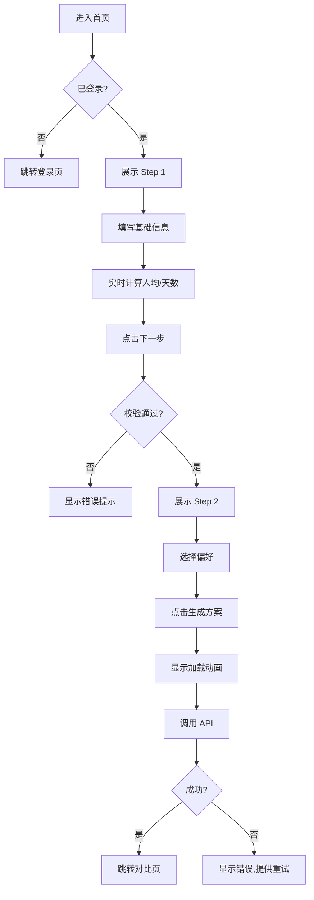
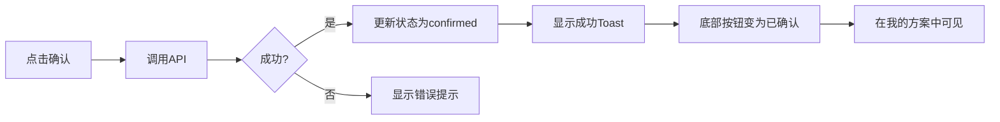
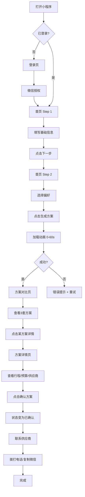
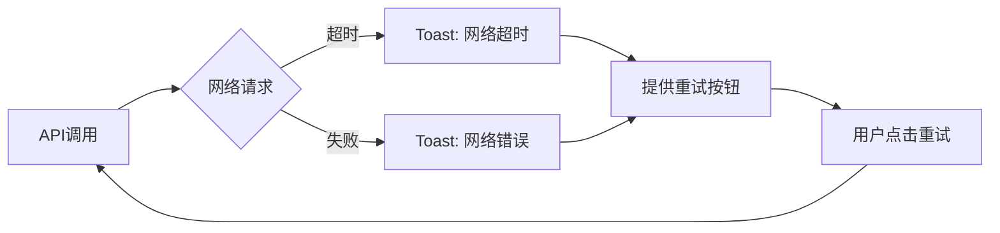
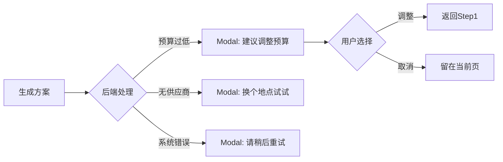

# TeamVenture 小程序 UX/UI/UE 详细交互设计规范

> **版本**: v1.1
> **更新日期**: 2026-01-02
> **设计原则**: 短路径、强引导、可对比
> **最新变更**: 登录页布局优化、目的地字段添加、生成方案用户指引增强

---

## 目录

1. [设计原则与理念](#1-设计原则与理念)
2. [视觉设计系统](#2-视觉设计系统)
3. [组件库规范](#3-组件库规范)
4. [页面详细设计](#4-页面详细设计)
5. [交互流程设计](#5-交互流程设计)
6. [动效设计](#6-动效设计)
7. [响应式与适配](#7-响应式与适配)
8. [边界情况处理](#8-边界情况处理)
9. [无障碍设计](#9-无障碍设计)
10. [交付物清单](#10-交付物清单)
11. [更新日志](#更新日志changelog)

---

## 1. 设计原则与理念

### 1.1 核心设计原则

#### 原则 1：短路径（Shortest Path）
**目标**: 减少用户决策成本，最快完成任务

- ✅ **Do**: 2步完成方案生成（基础信息 → 偏好选择）
- ✅ **Do**: 默认值覆盖80%场景（如：50人、2天1夜）
- ❌ **Don't**: 过度细分步骤，避免超过3步

**示例**:
```
传统流程: 注册 → 填写企业信息 → 选择套餐 → 填写需求 → 生成方案（5步）
TeamVenture: 登录 → 填写需求 → 生成方案（2步）
```

#### 原则 2：强引导（Strong Guidance）
**目标**: 降低学习成本，即使第一次使用也能快速上手

- ✅ **Do**: 使用步骤指示器，清晰展示进度
- ✅ **Do**: 提供实时反馈（如：人均预算自动计算）
- ✅ **Do**: 关键操作点使用视觉强化（大按钮、高对比色）
- ❌ **Don't**: 隐藏重要功能在二级菜单

**示例**:
```
❌ 错误: "请输入预算" （用户不知道合理范围）
✅ 正确: "预算范围：¥35,000 - ¥50,000（人均 ¥700-¥1,000）" + 实时提示
```

#### 原则 3：可对比（Comparable）
**目标**: 帮助用户快速做出最优决策

- ✅ **Do**: 3套方案并列展示，关键差异一目了然
- ✅ **Do**: 使用对比表格突出差异点
- ✅ **Do**: 标记推荐方案，但不替用户决策
- ❌ **Don't**: 只展示单一方案

**示例**:
```
方案对比维度：总预算、人均成本、住宿标准、活动丰富度、适合人群
```

---

### 1.2 用户体验目标

| 指标 | 目标值 | 测量方式 |
|------|--------|---------|
| **首次完成任务时间** | <5分钟 | 从进入首页到生成方案 |
| **方案生成成功率** | >95% | 成功生成/提交次数 |
| **用户满意度（NPS）** | >30 | 用户调研问卷 |
| **页面加载时间** | <2秒 | 性能监控 |
| **交互响应时间** | <300ms | 点击到反馈时间 |

---

## 2. 视觉设计系统

### 2.1 色彩系统（Color System）

#### 主色彩（Primary Colors）

```css
/* 主色 - 蓝色系（信任、专业） */
--primary-color: #1890ff;           /* 主要操作按钮、选中状态 */
--primary-hover: #0070dd;           /* 按钮悬停/按下 */
--primary-light: #e6f7ff;           /* 浅色背景、高亮提示 */
--primary-deep: #0050b3;            /* 深色强调 */

/* 辅助色 */
--success-color: #52c41a;           /* 成功状态、确认操作 */
--warning-color: #faad14;           /* 警告提示 */
--error-color: #f5222d;             /* 错误提示、必填项 */
--info-color: #1890ff;              /* 信息提示 */
```

#### 中性色（Neutral Colors）

```css
/* 文字颜色 */
--text-primary: #333333;            /* 主要文字 */
--text-secondary: #666666;          /* 次要文字 */
--text-muted: #999999;              /* 辅助文字、占位符 */
--text-disabled: #d9d9d9;           /* 禁用状态 */

/* 背景颜色 */
--bg-page: #f5f5f5;                 /* 页面背景 */
--bg-card: #ffffff;                 /* 卡片背景 */
--bg-hover: #f0f0f0;                /* 悬停背景 */
--bg-disabled: #fafafa;             /* 禁用背景 */

/* 边框颜色 */
--border-color: #e8e8e8;            /* 常规边框 */
--border-light: #f0f0f0;            /* 浅色边框 */
--border-dark: #d9d9d9;             /* 深色边框 */
```

#### 渐变色（Gradient）

```css
/* 登录页背景渐变 */
--gradient-primary: linear-gradient(135deg, #667eea 0%, #764ba2 100%);

/* 卡片高光渐变（可选） */
--gradient-card: linear-gradient(180deg, #ffffff 0%, #f9f9f9 100%);
```

#### 色彩使用场景

| 场景 | 颜色 | 示例 |
|------|------|------|
| 主要操作 | Primary | "生成方案"、"确认此方案" 按钮 |
| 成功反馈 | Success | "已确认"状态、"生成成功"提示 |
| 警告提示 | Warning | "预算可能偏低"提示 |
| 错误提示 | Error | "必填项未填写"、"网络错误" |
| 选中状态 | Primary Light | 选中的 chip、选中的方案卡片 |
| 禁用状态 | Disabled | 不可点击的按钮、已过期的方案 |

---

### 2.2 字体系统（Typography）

#### 字体族（Font Family）

```css
/* 系统字体栈（优先使用系统默认字体） */
font-family: -apple-system-font, "Helvetica Neue", "PingFang SC",
             "Hiragino Sans GB", "Microsoft YaHei", sans-serif;
```

#### 字体大小（Font Sizes）

```css
/* 标题 */
--font-size-h1: 40rpx;              /* 页面主标题 */
--font-size-h2: 36rpx;              /* 二级标题 */
--font-size-h3: 32rpx;              /* 三级标题、表单标签 */

/* 正文 */
--font-size-body: 28rpx;            /* 正文、输入框 */
--font-size-small: 24rpx;           /* 辅助文字、提示 */
--font-size-tiny: 20rpx;            /* 角标、次要提示 */

/* 特殊 */
--font-size-number-large: 48rpx;    /* 金额、人数等关键数字 */
--font-size-number-medium: 36rpx;   /* 次要数字 */
```

#### 字重（Font Weights）

```css
--font-weight-normal: 400;          /* 常规文字 */
--font-weight-medium: 500;          /* 强调文字、按钮 */
--font-weight-bold: 600;            /* 标题、重要数字 */
```

#### 行高（Line Heights）

```css
--line-height-tight: 1.2;           /* 标题 */
--line-height-normal: 1.5;          /* 正文 */
--line-height-loose: 1.8;           /* 段落 */
```

#### 字体使用场景

| 场景 | 字号 | 字重 | 颜色 | 示例 |
|------|------|------|------|------|
| 页面标题 | 40rpx | 600 | #333 | "告诉我们您的团建需求" |
| 表单标签 | 32rpx | 500 | #333 | "参与人数"、"预算范围" |
| 输入框文字 | 28rpx | 400 | #333 | 用户输入内容 |
| 占位符 | 28rpx | 400 | #ccc | "请输入出发城市或地点" |
| 辅助说明 | 24rpx | 400 | #999 | "人均预算：¥700-¥1,000" |
| 关键数字 | 48rpx | 600 | #333 | "¥45,000"、"50人" |
| 按钮文字 | 32rpx | 500 | #fff | "下一步"、"生成方案" |

---

### 2.3 间距系统（Spacing System）

#### 间距规范（基于 8rpx 倍数）

```css
/* 基础间距单位 */
--spacing-xs: 8rpx;                 /* 极小间距 */
--spacing-sm: 16rpx;                /* 小间距 */
--spacing-md: 24rpx;                /* 中等间距 */
--spacing-lg: 32rpx;                /* 大间距 */
--spacing-xl: 48rpx;                /* 超大间距 */
--spacing-xxl: 64rpx;               /* 特大间距 */
```

#### 组件内边距（Padding）

| 组件 | 内边距 | 示例 |
|------|--------|------|
| 页面容器 | 32rpx | `.container { padding: 32rpx; }` |
| 卡片 | 32rpx | `.card { padding: 32rpx; }` |
| 按钮 | 24rpx 48rpx | `.button { padding: 24rpx 48rpx; }` |
| 输入框 | 24rpx 32rpx | `.input { padding: 24rpx 32rpx; }` |
| 标签（Chip） | 16rpx 32rpx | `.chip { padding: 16rpx 32rpx; }` |

#### 组件外边距（Margin）

| 场景 | 外边距 | 示例 |
|------|--------|------|
| 表单项之间 | 48rpx | `.form-item + .form-item { margin-top: 48rpx; }` |
| 卡片之间 | 24rpx | `.card + .card { margin-top: 24rpx; }` |
| 标签之间 | 16rpx | `.chip + .chip { margin-left: 16rpx; }` |
| 文本段落 | 16rpx | `p + p { margin-top: 16rpx; }` |

---

### 2.4 圆角与阴影（Border Radius & Shadow）

#### 圆角（Border Radius）

```css
--radius-sm: 8rpx;                  /* 小圆角：按钮、标签 */
--radius-md: 12rpx;                 /* 中圆角：输入框、卡片 */
--radius-lg: 16rpx;                 /* 大圆角：卡片 */
--radius-xl: 24rpx;                 /* 超大圆角：特殊卡片 */
--radius-round: 999rpx;             /* 圆形：头像、图标按钮 */
```

#### 阴影（Box Shadow）

```css
/* 卡片阴影 */
--shadow-sm: 0 2rpx 8rpx rgba(0, 0, 0, 0.04);      /* 浅阴影 */
--shadow-md: 0 2rpx 12rpx rgba(0, 0, 0, 0.08);     /* 中阴影 */
--shadow-lg: 0 4rpx 16rpx rgba(0, 0, 0, 0.12);     /* 深阴影 */

/* 按钮阴影 */
--shadow-button: 0 8rpx 24rpx rgba(24, 144, 255, 0.15);

/* 浮动元素阴影 */
--shadow-float: 0 8rpx 32rpx rgba(0, 0, 0, 0.12);
```

---

### 2.5 图标系统（Icon System）

#### 图标尺寸

```css
--icon-xs: 32rpx;                   /* 小图标 */
--icon-sm: 40rpx;                   /* 中图标 */
--icon-md: 48rpx;                   /* 大图标 */
--icon-lg: 64rpx;                   /* 超大图标 */
--icon-xl: 96rpx;                   /* 特大图标（空状态） */
```

#### 图标使用场景

| 场景 | 尺寸 | 颜色 | 示例 |
|------|------|------|------|
| TabBar 图标 | 48rpx | #666/#1890ff | 底部导航图标 |
| 功能图标 | 40rpx | #666 | 表单输入框右侧 |
| 装饰图标 | 48rpx | 主题色 | 功能亮点展示 |
| 空状态图标 | 96rpx | #ccc | 无数据提示 |
| Emoji 图标 | 32-52rpx | 原生色 | 功能标识、按钮装饰 |

**图标来源**:
- 优先使用：阿里 iconfont、微信官方图标库
- 备选：手动绘制 SVG（保持统一风格）
- **v1.1 新增**: Emoji 图标（无需额外资源，跨平台兼容）

**v1.1 Emoji 图标设计模式**

**使用场景**:
1. **功能亮点展示**: ⚡💰🎯 等表达产品特点
2. **按钮装饰**: 🔐✨ 等增强视觉吸引力
3. **表单标签**: 👥💰📅📍🎯🏠🍴📝 等辅助识别字段
4. **提示信息**: 💡⏱️ 等强化信息层级

**优势**:
- ✓ 无需额外图片资源，减小包体积
- ✓ 原生支持，跨平台兼容性好
- ✓ 色彩丰富，视觉效果友好
- ✓ 快速迭代，无需设计师切图

**使用规范**:
```css
/* Emoji 作为功能图标 */
.feature-icon {
  font-size: 52rpx;
  width: 72rpx;
  height: 72rpx;
  display: flex;
  align-items: center;
  justify-content: center;
}

/* Emoji 作为按钮图标 */
.btn-icon {
  font-size: 36rpx;
  margin-right: 8rpx;
}

/* Emoji 作为提示图标 */
.tip-icon {
  font-size: 36rpx;
  margin-right: 16rpx;
  line-height: 1;
}
```

**已使用的 Emoji 映射**:
- 🔐 - 安全/登录
- ⚡ - 快速/效率
- 💰 - 成本/预算
- 🎯 - 精准/目标
- 👥 - 人数/团队
- 📅 - 日期/时间
- 📍 - 地点/位置
- 🏠 - 住宿
- 🍴 - 餐饮
- 📝 - 需求/备注
- ✨ - AI/智能/生成
- 💡 - 提示/建议
- ⏱️ - 时长/等待

---

## 3. 组件库规范

### 3.1 按钮（Button）

#### 按钮类型

##### 1. 主要按钮（Primary Button）

**使用场景**: 页面主要操作

```css
/* 样式规范 */
background: #1890ff;
color: #ffffff;
border-radius: 44rpx;              /* 圆角按钮 */
padding: 24rpx 48rpx;
font-size: 32rpx;
font-weight: 500;
min-height: 88rpx;
box-shadow: 0 8rpx 24rpx rgba(24, 144, 255, 0.15);

/* 交互状态 */
:hover { background: #40a9ff; }
:active { background: #0070dd; }
:disabled {
  background: #d9d9d9;
  color: #999;
  box-shadow: none;
}
```

**示例**: "生成方案"、"确认此方案"、"下一步"

##### 2. 次要按钮（Secondary Button）

**使用场景**: 辅助操作

```css
/* 样式规范 */
background: #ffffff;
color: #1890ff;
border: 2rpx solid #1890ff;
border-radius: 44rpx;
padding: 24rpx 48rpx;
font-size: 32rpx;
font-weight: 500;
min-height: 88rpx;

/* 交互状态 */
:hover { background: #f0f8ff; }
:active { background: #e6f7ff; }
```

**示例**: "上一步"、"取消"

##### 3. 文字按钮（Text Button）

**使用场景**: 弱化操作

```css
/* 样式规范 */
background: transparent;
color: #1890ff;
padding: 16rpx 24rpx;
font-size: 28rpx;

/* 交互状态 */
:hover { color: #40a9ff; }
:active { color: #0070dd; }
```

**示例**: "查看详情"、"编辑"

#### 按钮尺寸

| 尺寸 | 高度 | 字号 | 使用场景 |
|------|------|------|---------|
| Large | 96rpx | 32rpx | 页面主操作（生成方案） |
| Medium | 88rpx | 32rpx | 常规操作（下一步） |
| Small | 64rpx | 28rpx | 卡片内操作（联系供应商） |

---

### 3.2 输入框（Input）

#### 文本输入框

```css
/* 样式规范 */
background: #ffffff;
border: 2rpx solid #e8e8e8;
border-radius: 12rpx;
padding: 24rpx 32rpx;
font-size: 28rpx;
color: #333;
min-height: 88rpx;

/* 交互状态 */
:focus {
  border-color: #1890ff;
  box-shadow: 0 0 0 4rpx rgba(24, 144, 255, 0.1);
}

/* 占位符 */
::placeholder {
  color: #ccc;
}

/* 错误状态 */
.error {
  border-color: #f5222d;
}
```

#### 数字输入框（Stepper）

**组件结构**:
```
[减号按钮] [数字输入] [加号按钮]
```

**样式规范**:
```css
/* 按钮 */
.stepper-btn {
  width: 56rpx;
  height: 56rpx;
  background: #f5f5f5;
  border-radius: 8rpx;
  font-size: 32rpx;
  color: #333;
}

/* 输入框 */
.stepper-input {
  min-width: 120rpx;
  text-align: center;
  font-size: 28rpx;
  font-weight: 500;
}
```

#### 日期选择器

**交互**:
- 点击触发微信原生日期选择器
- 限制最小日期为当前日期
- 结束日期不能早于开始日期

---

### 3.3 标签（Chip/Tag）

#### 可选标签（Selectable Chip）

**使用场景**: 多选/单选选项（活动类型、餐饮偏好）

```css
/* 未选中状态 */
background: #f5f5f5;
color: #666;
border: 2rpx solid transparent;
border-radius: 40rpx;
padding: 16rpx 32rpx;
font-size: 28rpx;

/* 选中状态 */
.selected {
  background: #e6f7ff;
  color: #1890ff;
  border-color: #1890ff;
  font-weight: 500;
}

/* 交互动效 */
transition: all 0.2s ease;
```

#### 状态标签（Status Tag）

**使用场景**: 方案状态展示

```css
/* 基础样式 */
padding: 8rpx 16rpx;
border-radius: 4rpx;
font-size: 24rpx;
display: inline-block;

/* 不同状态 */
.tag-draft {
  background: #f0f0f0;
  color: #666;
}

.tag-confirmed {
  background: #f6ffed;
  color: #52c41a;
}

.tag-cancelled {
  background: #fff1f0;
  color: #f5222d;
}
```

---

### 3.4 卡片（Card）

#### 基础卡片

```css
background: #ffffff;
border-radius: 16rpx;
padding: 32rpx;
box-shadow: 0 2rpx 12rpx rgba(0, 0, 0, 0.05);
margin-bottom: 24rpx;
```

#### 方案卡片（Plan Card）

**结构**:
```
┌─────────────────────┐
│ [标签] 方案A - 经济型 │
│                     │
│ ¥35,000             │  <- 大字号金额
│ ¥700/人             │  <- 次级字号
│                     │
│ 🏠 农家乐            │
│ 🎯 2个活动           │
│ 🍴 农家菜            │
│                     │
│ [查看详情] [选择]    │
└─────────────────────┘
```

**样式规范**:
```css
.plan-card {
  background: #fff;
  border-radius: 16rpx;
  padding: 32rpx;
  border: 2rpx solid #e8e8e8;
  transition: all 0.3s ease;
}

/* 推荐方案 */
.plan-card.recommended {
  border-color: #1890ff;
  box-shadow: 0 4rpx 16rpx rgba(24, 144, 255, 0.15);
}

/* 选中状态 */
.plan-card.selected {
  border-color: #1890ff;
  background: #e6f7ff;
}

/* 悬停效果 */
.plan-card:hover {
  box-shadow: 0 4rpx 16rpx rgba(0, 0, 0, 0.1);
  transform: translateY(-4rpx);
}
```

---

### 3.5 步骤指示器（Steps）

**使用场景**: 引导用户完成多步流程

**结构**:
```
[1·完成] ───── [2·进行中] ───── [3·未开始]
基础信息        偏好选择         生成中
```

**样式规范**:
```css
/* 步骤圆圈 */
.step-number {
  width: 56rpx;
  height: 56rpx;
  border-radius: 50%;
  background: #e8e8e8;
  color: #999;
  font-size: 28rpx;
  font-weight: 500;
}

/* 当前步骤 */
.step.active .step-number {
  background: #1890ff;
  color: #fff;
}

/* 已完成步骤 */
.step.completed .step-number {
  background: #52c41a;
  color: #fff;
}

/* 连接线 */
.step-line {
  flex: 1;
  height: 2rpx;
  background: #e8e8e8;
}

.step-line.active {
  background: #52c41a;
}
```

---

### 3.6 加载与反馈

#### 加载动画（Loading）

**场景 1: 全屏加载**

```javascript
wx.showLoading({
  title: '正在生成方案...',
  mask: true  // 遮罩防止误操作
})
```

**场景 2: 方案生成进度**

**结构**:
```
┌─────────────────────────────┐
│        🤖                   │
│                             │
│   正在为您生成方案...        │
│                             │
│ ✓ 已分析您的团队画像         │
│ ✓ 已匹配 27 家供应商         │
│ ⏳ 正在生成 3 套差异化方案... │
│                             │
│ [████████░░░░] 80%          │
│                             │
│ 预计还需 15 秒               │
└─────────────────────────────┘
```

**交互逻辑**:
- 显示具体进度，而不是无限转圈
- 超过 60 秒提供"重试"选项
- 使用渐进式文案减少焦虑

#### Toast 提示

```javascript
// 成功提示
wx.showToast({
  title: '方案已确认',
  icon: 'success',
  duration: 2000
})

// 错误提示
wx.showToast({
  title: '网络错误，请稍后重试',
  icon: 'none',
  duration: 2000
})
```

---

## 4. 页面详细设计

### 4.1 登录页（Login Page）

#### 页面目标
- 快速完成微信授权登录
- 传达产品核心价值
- 建立信任感

#### 布局结构

```
┌───────────────────────────┐
│    [TV Logo]              │  ← 100rpx padding-top（v1.1 优化）
│    TeamVenture            │  ← 56rpx font-size
│  AI驱动的团建策划助手      │  ← 28rpx font-size
│                           │  ← 100rpx margin-bottom（v1.1 优化）
│ ┌───────────────────────┐ │
│ │ ⚡ 15分钟生成方案      │ │
│ │ 💰 成本降低50%+        │ │  ← 功能亮点卡片
│ │ 🎯 智能供应商匹配      │ │  ← 56rpx padding（v1.1 优化）
│ └───────────────────────┘ │
│                           │  ← 100rpx margin-bottom（v1.1 优化）
│ [🔐 微信一键登录]         │  ← 100rpx 高度圆角按钮
│                           │  ← 56rpx margin-bottom（v1.1 优化）
│ ☑ 我已阅读并同意          │
│   《用户协议》《隐私政策》 │
│                           │  ← 40rpx margin-bottom（v1.1 优化）
│  [装饰圆圈]               │  ← 背景装饰
└───────────────────────────┘
```

**v1.1 布局优化说明**:
- 采用 Flexbox 布局 (`display: flex; flex-direction: column`)
- 增加垂直间距，整体更工整、更有呼吸感
- 功能亮点卡片内边距从 `32rpx` 增加到 `56rpx 48rpx`
- 所有功能项保持一致的最小高度 `80rpx`，确保图标和文字完美对齐

#### 视觉规范

**背景渐变**:
```css
background: linear-gradient(135deg, #667eea 0%, #764ba2 100%);
```

**Logo（v1.1 实现方式更新）**:
- 尺寸: 160rpx × 160rpx
- 圆角: 32rpx
- 阴影: `0 8rpx 32rpx rgba(0, 0, 0, 0.15)`
- **实现**: 使用 CSS 渐变背景 + 文字 "TV"，无需图片资源
- 背景: `linear-gradient(135deg, #1890ff 0%, #096dd9 100%)`
- 文字: 64rpx 粗体白色，垂直居中对齐

```css
.logo {
  width: 160rpx;
  height: 160rpx;
  margin: 0 auto 40rpx;
  border-radius: 32rpx;
  box-shadow: 0 8rpx 32rpx rgba(0, 0, 0, 0.15);
  background: linear-gradient(135deg, #1890ff 0%, #096dd9 100%);
  display: flex;
  align-items: center;
  justify-content: center;
}

.logo-text {
  font-size: 64rpx;
  font-weight: 700;
  color: #fff;
  letter-spacing: 2rpx;
}
```

**登录按钮（v1.1 图标优化）**:
- 图标: 使用 emoji 🔐 代替图片，无需额外资源
- 图标尺寸: 40rpx
```css
background: #ffffff;
color: #333;
border-radius: 48rpx;
height: 96rpx;
box-shadow: 0 8rpx 24rpx rgba(0, 0, 0, 0.15);
```

#### 交互流程

```mermaid
graph LR
    A[进入登录页] --> B{已登录?}
    B -->|是| C[显示"继续使用"按钮]
    B -->|否| D[显示"微信一键登录"按钮]
    D --> E[点击登录]
    E --> F{协议勾选?}
    F -->|否| G[提示勾选协议]
    F -->|是| H[请求微信授权]
    H --> I{授权成功?}
    I -->|是| J[调用后端登录]
    I -->|否| K[提示授权失败]
    J --> L[跳转首页]
    C --> L
```

#### 边界情况

| 场景 | 处理方式 |
|------|---------|
| 用户拒绝授权 | 提示"需要授权才能使用"，保留按钮重试 |
| 网络错误 | 提示"网络错误，请稍后重试"，提供重试按钮 |
| 后端登录失败 | 显示具体错误信息，保留重试选项 |

---

### 4.2 生成方案页（Index Page）

#### 页面目标
- 快速收集用户需求（2步完成）
- 提供智能默认值和实时反馈
- 降低填写负担

#### Step 1: 基础信息

**布局结构**:

```
┌─────────────────────────────────┐
│ [1·进行中] ── [2·未开始]        │  ← 步骤指示器
├─────────────────────────────────┤
│ 告诉我们您的团建需求             │  ← 40rpx 标题
│                                 │
│ 👥 参与人数 *                   │
│ [- 50 +] 人                     │  ← Stepper
│ [20人] [50人] [100人]           │  ← 快捷按钮
│                                 │
│ 💰 预算范围 *                   │
│ ¥[最低] - ¥[最高]              │  ← 双输入框
│ 人均预算：¥700-¥1,000           │  ← 实时计算
│                                 │
│ 📅 活动日期 *                   │
│ [2025-05-10] 至 [2025-05-11]   │  ← 日期选择器
│ 2天1夜                          │  ← 自动计算天数
│                                 │
│ 📍 出发地点 *                   │
│ [北京市朝阳区]                  │  ← 文本输入
│                                 │
│ 🎯 目的地（可选，留空则由AI推荐）│  ← v1.1 新增
│ [例如：北京怀柔、杭州千岛湖等]   │  ← 文本输入
│                                 │
│         [下一步]                │  ← 主按钮
└─────────────────────────────────┘
```

**字段规范**:

| 字段 | 类型 | 必填 | 默认值 | 校验规则 | v1.1 变更 |
|------|------|------|--------|---------|----------|
| 参与人数 | Number | ✓ | 50 | 1-500 | - |
| 最低预算 | Number | ✓ | - | >0 | - |
| 最高预算 | Number | ✓ | - | ≥最低预算 | - |
| 开始日期 | Date | ✓ | - | ≥今天 | - |
| 结束日期 | Date | ✓ | - | ≥开始日期 | - |
| 出发地点 | String | ✓ | - | 非空 | - |
| 目的地 | String | ✗ | '' | 可选 | **新增** |

**目的地字段说明（v1.1）**:
- **定位**: 可选字段，允许用户指定明确目的地
- **占位符**: "例如：北京怀柔、杭州千岛湖等"
- **提示文案**: "（可选，留空则由AI推荐）"
- **设计理由**: 用户反馈缺少目的地设定，增加此字段提升灵活性
- **交互逻辑**: 如果填写，API 优先按目的地推荐；如果留空，AI 根据其他条件推荐

**实时反馈**:

1. **人均预算计算**:
```javascript
人均预算 = (最低预算 + 最高预算) / 2 / 参与人数
显示: "人均预算：¥700 - ¥1,000"
```

2. **预算警告**:
```javascript
if (人均预算 < 300) {
  显示: "⚠️ 预算可能偏低，建议适当调整"
  颜色: #faad14
}
```

3. **天数计算**:
```javascript
天数 = (结束日期 - 开始日期) + 1
显示: "2天1夜" | "3天2夜"
颜色: #52c41a
```

#### Step 2: 偏好选择

**布局结构**:

```
┌─────────────────────────────────┐
│ [1·完成] ── [2·进行中]          │  ← 步骤指示器
├─────────────────────────────────┤
│ 选择您的偏好                     │  ← 40rpx 标题
│                                 │
│ 🎯 活动类型（可多选）            │
│ [团队拓展][休闲度假]             │  ← Chips 多选
│ [文化体验][运动挑战]             │
│                                 │
│ 🏠 住宿标准                     │
│ ○ 经济型（农家乐）               │  ← Radio 单选
│ ● 舒适型（民宿）                │
│ ○ 品质型（酒店）                │
│                                 │
│ 🍴 餐饮偏好（可多选）            │
│ [农家菜][烧烤]                  │  ← Chips 多选
│ [火锅][西餐]                    │
│                                 │
│ 📝 特殊需求（选填）              │
│ ┌─────────────────────────┐    │
│ │请输入特殊需求，如：       │    │  ← Textarea
│ │有老人或小孩、身体限制等   │    │
│ └─────────────────────────┘    │
│ 0/200                           │  ← 字数统计
│                                 │
│ ┌─────────────────────────┐    │  ← v1.1 新增提示框
│ │ 💡 点击「生成方案」后，   │    │
│ │    AI将为您生成3套方案供对比│   │
│ │ ⏱️ 生成时间约15-30秒，    │    │
│ │    请耐心等待             │    │
│ └─────────────────────────┘    │
│                                 │
│ [上一步]  [✨ AI 生成方案]      │  ← 双按钮（v1.1 增强）
└─────────────────────────────────┘
```

**默认值策略**:

| 字段 | 默认值 | 理由 |
|------|--------|------|
| 活动类型 | 无 | 让用户主动选择，避免错误假设 |
| 住宿标准 | 舒适型 | 覆盖80%场景，性价比平衡 |
| 餐饮偏好 | 无 | 可选项，不强制 |

**v1.1 新增：用户引导提示框**

**设计目的**: 解决用户不了解生成流程的问题，降低焦虑，设定正确预期。

**视觉规范**:
```css
.generate-tips {
  margin-top: 48rpx;
  padding: 32rpx;
  background: linear-gradient(135deg, #f0f9ff 0%, #e6f7ff 100%);
  border-radius: 16rpx;
  border: 2rpx solid #91d5ff;
}

.tip-item {
  display: flex;
  align-items: flex-start;
  margin-bottom: 20rpx;
}

.tip-icon {
  font-size: 36rpx;
  margin-right: 16rpx;
  flex-shrink: 0;
  line-height: 1;
}

.tip-text {
  font-size: 26rpx;
  color: #1890ff;
  line-height: 1.6;
  flex: 1;
  font-weight: 500;
}
```

**提示内容**:
- 💡 点击「生成方案」后，AI将为您生成3套方案供对比
- ⏱️ 生成时间约15-30秒，请耐心等待

**v1.1 增强：生成方案按钮**

**设计优化**:
```css
.btn-generate {
  width: 100%;
  height: 88rpx;
  border-radius: 44rpx;
  background-color: #1890ff;
  color: #fff;
  font-size: 32rpx;
  font-weight: 500;
  display: flex;
  align-items: center;
  justify-content: center;
}

.btn-icon {
  font-size: 36rpx;
  margin-right: 8rpx;
}
```

**WXML 结构**:
```xml
<button class="btn-generate" bindtap="handleGenerate">
  <text class="btn-icon">✨</text>
  <text>AI 生成方案</text>
</button>
```

**设计理由**:
- ✨ emoji 增加视觉吸引力和亲和力
- "AI 生成方案"文案明确功能，强调技术优势
- Flexbox 布局确保图标和文字完美居中对齐

#### 交互流程



---

### 4.3 方案对比页（Comparison Page）

#### 页面目标
- 快速对比 3 套方案差异
- 帮助用户做出最优决策
- 提供推荐但不替用户决策

#### 布局结构

```
┌─────────────────────────────────────────────┐
│ 为您生成了 3 套方案，请选择最适合您的：       │
├─────────────────────────────────────────────┤
│                                             │
│ ┌──────┐  ┌──────┐  ┌──────┐              │
│ │方案A │  │方案B │  │方案C │   ⭐推荐     │
│ │经济型│  │平衡型│  │品质型│              │
│ │      │  │      │  │      │              │
│ │35,000│  │45,000│  │60,000│              │  ← 总预算
│ │¥700/人│ │¥900/人│ │¥1200/人│            │  ← 人均
│ │      │  │      │  │      │              │
│ │🏠农家乐│ │🏠民宿 │ │🏠度假酒店│          │  ← 住宿
│ │🎯2活动│  │🎯3活动│  │🎯4活动│           │  ← 活动
│ │🍴农家菜│ │🍴特色餐│ │🍴精品餐│          │  ← 餐饮
│ │      │  │      │  │      │              │
│ │[详情]│  │[详情]│  │[详情]│              │
│ │[选择]│  │[选择]│  │[选择]│              │
│ └──────┘  └──────┘  └──────┘              │
│                                             │
│ ▼ 查看详细对比表                            │  ← 折叠面板
│                                             │
│ ┌───────────────────────────────────────┐  │
│ │         方案A    方案B    方案C        │  │
│ │ 总预算  35,000   45,000   60,000      │  │
│ │ 人均    ¥700     ¥900     ¥1,200     │  │  ← 对比表格
│ │ 住宿    农家乐   民宿     度假酒店     │  │
│ │ 活动    2个      3个      4个         │  │
│ │ 餐饮    农家菜   特色餐   精品餐厅     │  │
│ │ 适合    预算有限 性价比   重视体验     │  │
│ └───────────────────────────────────────┘  │
│                                             │
│            [重新生成]                       │  ← 次要按钮
└─────────────────────────────────────────────┘
```

#### 方案卡片详细设计

**尺寸**: 每列宽度 `(750rpx - 64rpx - 32rpx) / 3 ≈ 218rpx`

**间距**: 卡片间距 16rpx

**推荐标识**:
```css
.plan-card.recommended::before {
  content: '⭐ 推荐';
  position: absolute;
  top: -12rpx;
  right: 16rpx;
  background: #faad14;
  color: #fff;
  padding: 4rpx 12rpx;
  border-radius: 12rpx;
  font-size: 20rpx;
}
```

#### 对比表格设计

**展开/折叠动效**:
```css
.comparison-table {
  max-height: 0;
  overflow: hidden;
  transition: max-height 0.3s ease;
}

.comparison-table.expanded {
  max-height: 1000rpx;
}
```

#### 交互细节

1. **推荐逻辑**:
```javascript
// 根据用户预算自动推荐
if (用户预算 < 40000) {
  推荐 = "方案A（经济型）"
} else if (用户预算 < 55000) {
  推荐 = "方案B（平衡型）"
} else {
  推荐 = "方案C（品质型）"
}
```

2. **点击"详情"**:
```javascript
wx.navigateTo({
  url: `/pages/detail/detail?planId=${planId}`
})
```

3. **点击"选择"**:
- 先跳转到详情页
- 在详情页可以"确认此方案"

4. **点击"重新生成"**:
```javascript
wx.showModal({
  title: '重新生成方案',
  content: '是否保留当前输入重新生成？',
  confirmText: '保留输入',
  cancelText: '全部重置',
  success: (res) => {
    if (res.confirm) {
      // 返回 Step 2
    } else {
      // 返回 Step 1 并清空
    }
  }
})
```

---

### 4.4 方案详情页（Detail Page）

#### 页面目标
- 展示完整方案信息（行程、预算、供应商）
- 支持确认方案和联系供应商
- 提供导出和分享功能

#### 布局结构

```
┌─────────────────────────────────┐
│ [< 返回]    方案详情             │  ← 导航栏
├─────────────────────────────────┤
│                                 │
│ ┌─────────────────────────────┐ │
│ │ 方案B - 平衡型      ⭐推荐  │ │
│ │                             │ │  ← 概览卡片
│ │ ¥45,000  |  ¥900/人  | 2天1夜│ │
│ │                             │ │
│ │ 💡 亮点：                    │ │
│ │ • 性价比高，适合大多数团队   │ │
│ │ • 民宿住宿舒适，活动丰富     │ │
│ └─────────────────────────────┘ │
│                                 │
│ ▼ 行程安排                      │  ← 折叠面板
│ ┌─────────────────────────────┐ │
│ │ Day 1（周六）                │ │
│ │ 08:30-09:00 公司集合         │ │
│ │ 09:00-11:00 前往目的地       │ │
│ │ 11:00-12:00 酒店check-in     │ │  ← 时间轴
│ │ 12:00-13:30 午餐：农家菜     │ │
│ │ 13:30-16:30 真人CS对抗赛     │ │
│ │ ...                         │ │
│ │ Day 2（周日）                │ │
│ │ ...                         │ │
│ └─────────────────────────────┘ │
│                                 │
│ ▼ 预算明细                      │  ← 折叠面板
│ ┌─────────────────────────────┐ │
│ │ 交通      ¥4,000            │ │
│ │ 住宿      ¥15,000           │ │
│ │ 餐饮      ¥10,000           │ │  ← 分类预算
│ │ 活动      ¥5,000            │ │
│ │ 其他      ¥1,000            │ │
│ │ ─────────────────           │ │
│ │ 总计      ¥45,000           │ │
│ └─────────────────────────────┘ │
│                                 │
│ ▼ 供应商信息                    │  ← 折叠面板
│ ┌─────────────────────────────┐ │
│ │ 🏨 怀柔山庄         ⭐ 4.5   │ │
│ │ 住宿 | ¥150/人/晚           │ │
│ │ #适合拓展 #湖景房            │ │  ← 供应商卡片
│ │ [拨打电话] [复制微信]        │ │
│ ├─────────────────────────────┤ │
│ │ 🎯 真人CS基地       ⭐ 4.8  │ │
│ │ 活动 | ¥100/人              │ │
│ │ #专业教练 #场地大            │ │
│ │ [拨打电话] [复制微信]        │ │
│ └─────────────────────────────┘ │
│                                 │
│ [确认此方案]                    │  ← 主按钮（固定底部）
└─────────────────────────────────┘
```

#### 折叠面板交互

**默认状态**: 行程安排默认展开，其他折叠

**展开动效**:
```css
.collapse-content {
  max-height: 0;
  overflow: hidden;
  transition: max-height 0.3s cubic-bezier(0.4, 0, 0.2, 1);
}

.collapse-content.expanded {
  max-height: 3000rpx;
}
```

#### 供应商卡片交互

**点击"拨打电话"**:
```javascript
wx.makePhoneCall({
  phoneNumber: '138****1234',
  success: () => {
    // 上报埋点
    trackEvent('supplier_contact', {
      supplier_id: xxx,
      contact_method: 'phone'
    })
  }
})
```

**点击"复制微信"**:
```javascript
wx.setClipboardData({
  data: 'huairou_shanzhuan',
  success: () => {
    wx.showToast({ title: '微信号已复制' })
    // 上报埋点
    trackEvent('supplier_contact', {
      supplier_id: xxx,
      contact_method: 'wechat'
    })
  }
})
```

#### 确认方案流程



---

### 4.5 我的方案页（My Plans Page）

#### 页面目标
- 查看历史方案列表
- 快速访问已确认的方案
- 支持方案管理（查看、删除）

#### 布局结构

```
┌─────────────────────────────────┐
│        我的方案                  │  ← TabBar 页面
├─────────────────────────────────┤
│                                 │
│ ┌─────────────────────────────┐ │
│ │ 密云水库度假  ✅ 已确认      │ │
│ │                             │ │
│ │ ¥45,000 | 50人 | 2天1夜     │ │  ← 方案卡片
│ │ 2025-05-10 至 2025-05-11    │ │
│ │                             │ │
│ │ 3天前                        │ │  ← 相对时间
│ └─────────────────────────────┘ │
│                                 │
│ ┌─────────────────────────────┐ │
│ │ 怀柔山野团建  📄 草稿        │ │
│ │                             │ │
│ │ ¥35,000 | 50人 | 2天1夜     │ │
│ │ 2025-04-20 至 2025-04-21    │ │
│ │                             │ │
│ │ 1周前                        │ │
│ └─────────────────────────────┘ │
│                                 │
│ [加载更多...]                   │  ← 分页加载
│                                 │
│ ┌─────────────────────────────┐ │
│ │        📭                   │ │
│ │     还没有方案               │ │  ← 空状态
│ │                             │ │
│ │   [去生成方案]               │ │
│ └─────────────────────────────┘ │
└─────────────────────────────────┘
```

#### 方案卡片设计

**状态标识**:
```css
/* 已确认 */
.status-confirmed {
  background: #f6ffed;
  color: #52c41a;
}

/* 草稿 */
.status-draft {
  background: #f0f0f0;
  color: #666;
}

/* 已取消 */
.status-cancelled {
  background: #fff1f0;
  color: #f5222d;
}
```

#### 交互细节

**点击卡片**:
```javascript
wx.navigateTo({
  url: `/pages/detail/detail?planId=${planId}`
})
```

**左滑删除**:
```html
<view class="plan-card" bindtouchstart="handleTouchStart" bindtouchmove="handleTouchMove">
  <view class="card-content">...</view>
  <view class="delete-btn" bindtap="handleDelete">删除</view>
</view>
```

**分页加载**:
```javascript
// 触底加载
onReachBottom() {
  if (!this.data.hasMore) return

  this.data.page++
  this.loadPlans()
}
```

---

## 5. 交互流程设计

### 5.1 核心用户流程（Happy Path）



### 5.2 异常流程处理

#### 场景 1: 网络错误



#### 场景 2: 生成失败



---

## 6. 动效设计

### 6.1 过渡动画

#### 页面切换

```css
/* 页面进入 */
@keyframes pageIn {
  from {
    opacity: 0;
    transform: translateX(100rpx);
  }
  to {
    opacity: 1;
    transform: translateX(0);
  }
}

.page-enter {
  animation: pageIn 0.3s cubic-bezier(0.4, 0, 0.2, 1);
}
```

#### 卡片悬停

```css
.card {
  transition: all 0.3s ease;
}

.card:hover {
  transform: translateY(-8rpx);
  box-shadow: 0 8rpx 24rpx rgba(0, 0, 0, 0.1);
}
```

### 6.2 加载动画

#### 骨架屏（Skeleton）

**使用场景**: 列表加载时

```css
.skeleton {
  background: linear-gradient(90deg, #f0f0f0 25%, #e8e8e8 50%, #f0f0f0 75%);
  background-size: 200% 100%;
  animation: skeleton-loading 1.5s ease-in-out infinite;
}

@keyframes skeleton-loading {
  0% { background-position: 200% 0; }
  100% { background-position: -200% 0; }
}
```

#### 进度条

**使用场景**: 方案生成中

```css
.progress-bar {
  height: 8rpx;
  background: #e8e8e8;
  border-radius: 4rpx;
  overflow: hidden;
}

.progress-fill {
  height: 100%;
  background: #1890ff;
  transition: width 0.3s ease;
}
```

### 6.3 微交互

#### 按钮点击反馈

```css
.button:active {
  transform: scale(0.98);
  opacity: 0.9;
}
```

#### Chip 选中动效

```css
.chip {
  transition: all 0.2s ease;
}

.chip.selected {
  animation: chipSelect 0.3s cubic-bezier(0.34, 1.56, 0.64, 1);
}

@keyframes chipSelect {
  0% { transform: scale(1); }
  50% { transform: scale(1.1); }
  100% { transform: scale(1); }
}
```

---

## 7. 响应式与适配

### 7.1 屏幕适配

**设计基准**: iPhone 6/7/8 (375px × 667px)

**rpx 换算**: 750rpx = 375px（1rpx = 0.5px）

### 7.2 安全区域适配

```css
/* 底部固定按钮需要考虑 iPhone X 底部安全区 */
.fixed-bottom-btn {
  padding-bottom: constant(safe-area-inset-bottom);
  padding-bottom: env(safe-area-inset-bottom);
}
```

### 7.3 不同屏幕尺寸

| 设备 | 宽度 | 适配方案 |
|------|------|---------|
| iPhone SE | 320px | 最小宽度测试 |
| iPhone 6/7/8 | 375px | 设计基准 |
| iPhone X/11 | 375px × 812px | 安全区适配 |
| iPhone Plus | 414px | 自适应放大 |
| iPad | 768px+ | 限制最大宽度 |

---

## 8. 边界情况处理

### 8.1 网络异常

| 场景 | 处理方式 | 用户看到 |
|------|---------|---------|
| 网络断开 | 禁用所有网络请求按钮 | Toast: "网络连接失败" |
| 请求超时 | 60秒后显示超时提示 | Modal: "请求超时，是否重试？" |
| 服务器错误 | 显示友好错误信息 | Toast: "服务暂时不可用" |

### 8.2 数据异常

| 场景 | 处理方式 | 用户看到 |
|------|---------|---------|
| 空列表 | 显示空状态插画 | "还没有方案，去生成一个吧" |
| 数据加载失败 | 显示错误状态 | "加载失败，点击重试" |
| 图片加载失败 | 显示占位图 | 默认图片或灰色占位 |

### 8.3 用户误操作

| 场景 | 处理方式 | 用户看到 |
|------|---------|---------|
| 删除方案 | 二次确认弹窗 | Modal: "确认删除此方案？" |
| 返回上一步 | 保留已填写内容 | 数据不丢失 |
| 退出生成流程 | 提示保存草稿 | Modal: "保存当前输入？" |

### 8.4 极端数据

| 场景 | 处理方式 | 示例 |
|------|---------|------|
| 超长文本 | 截断 + 省略号 | "北京市朝阳区建国门外..." |
| 超大数字 | 千分位格式化 | ¥1,234,567 |
| 超长列表 | 分页加载 | 每页10条 |

---

## 9. 无障碍设计

### 9.1 视觉无障碍

**颜色对比度**: 所有文字与背景对比度 ≥ 4.5:1

**字体大小**: 最小字号 24rpx（12px）

**点击区域**: 最小点击区域 88rpx × 88rpx（44px × 44px）

### 9.2 操作无障碍

**键盘导航**: 所有表单支持 Tab 键切换

**错误提示**: 表单错误就地显示，红色高亮

**加载反馈**: 所有异步操作提供明确反馈

---

## 10. 交付物清单

### 10.1 设计稿

- [ ] Figma 高保真设计稿（全部页面）
- [ ] 组件库（Figma Components）
- [ ] 设计规范文档（本文档）

### 10.2 切图资源

- [ ] TabBar 图标（普通 + 选中态）@2x @3x
- [ ] Logo（多尺寸）
- [ ] 空状态插画
- [ ] 装饰图标

### 10.3 标注

- [ ] 蓝湖标注（或 Figma Dev Mode）
- [ ] 间距、字号、颜色标注
- [ ] 交互说明文档

---

## 附录

### A. 设计检查清单

**视觉一致性**:
- [ ] 所有按钮圆角统一（8/12/16/24rpx）
- [ ] 所有卡片阴影统一
- [ ] 所有字号符合规范

**交互一致性**:
- [ ] 所有加载提示统一
- [ ] 所有错误提示统一
- [ ] 所有成功反馈统一

**体验完整性**:
- [ ] 所有页面有加载状态
- [ ] 所有页面有空状态
- [ ] 所有页面有错误状态

### B. 参考资源

- [微信小程序设计指南](https://developers.weixin.qq.com/miniprogram/design/)
- [Ant Design 设计语言](https://ant.design/docs/spec/introduce-cn)
- [iOS 人机界面指南](https://developer.apple.com/design/human-interface-guidelines/)

---

## 更新日志（Changelog）

### v1.1 (2026-01-02)

#### 登录页优化
- **布局重构**: 采用 Flexbox 布局，整体更工整
- **间距优化**:
  - Header padding-top: 100rpx（原 120rpx）
  - 标题与功能卡片间距: 100rpx（新增）
  - 功能卡片内边距: 56rpx 48rpx（原 32rpx）
  - 功能项最小高度: 80rpx，确保图标和文字完美对齐
  - 按钮上下间距: 100rpx + 56rpx（新增）
  - 协议区域底边距: 40rpx（新增）
- **Logo 实现变更**:
  - 从图片改为 CSS 渐变背景 + "TV" 文字
  - 无需图片资源，加载更快
  - 背景: `linear-gradient(135deg, #1890ff 0%, #096dd9 100%)`
- **图标优化**:
  - 登录按钮图标从图片改为 emoji 🔐
  - 无需额外资源，跨平台兼容

#### 生成方案页（首页）优化
- **新增字段 - 目的地**:
  - 位置: Step 1，出发地点之后
  - 类型: 可选文本输入
  - 占位符: "例如：北京怀柔、杭州千岛湖等"
  - 提示: "（可选，留空则由AI推荐）"
  - 设计理由: 用户反馈缺少目的地设定，增加灵活性
- **新增用户引导提示框**:
  - 位置: Step 2，特殊需求下方
  - 样式: 蓝色渐变背景 + 边框
  - 内容:
    - 💡 点击「生成方案」后，AI将为您生成3套方案供对比
    - ⏱️ 生成时间约15-30秒，请耐心等待
  - 设计目的: 明确用户预期，降低焦虑
- **生成按钮增强**:
  - 添加 ✨ emoji 图标
  - 文案优化: "生成方案" → "AI 生成方案"
  - 使用 Flexbox 确保图标和文字居中对齐

#### 设计系统增强
- **新增 Emoji 图标设计模式**:
  - 定义使用场景和规范
  - 建立 Emoji 语义映射表（13个常用图标）
  - 优势: 无需资源、快速迭代、跨平台兼容
- **间距系统优化**:
  - 登录页整体间距增加，更有呼吸感
  - 组件内对齐规范化（Flexbox + min-height）

#### 技术实现
- 登录页 WXSS: 重构布局，增加 Flexbox
- 登录页 WXML: Logo 和图标结构变更
- 首页 WXML: 添加目的地字段、提示框
- 首页 JS: 添加 `destination` 字段和处理函数
- 首页 WXSS: 添加提示框和按钮图标样式

#### 设计文件
- 更新 UX/UI 规范文档至 v1.1
- 所有变更已标注 "v1.1" 标识

---

**文档版本**: v1.1
**最后更新**: 2026-01-02
**维护者**: TeamVenture 设计团队
